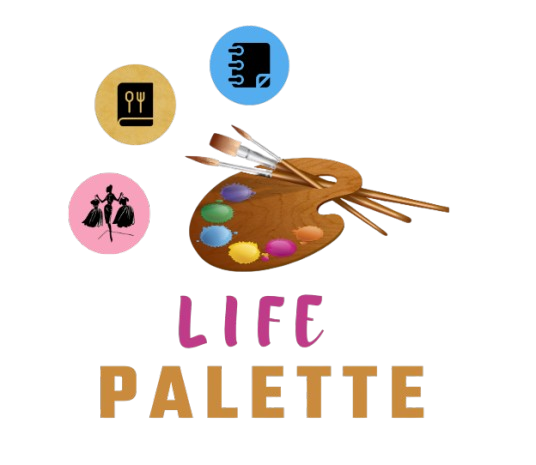
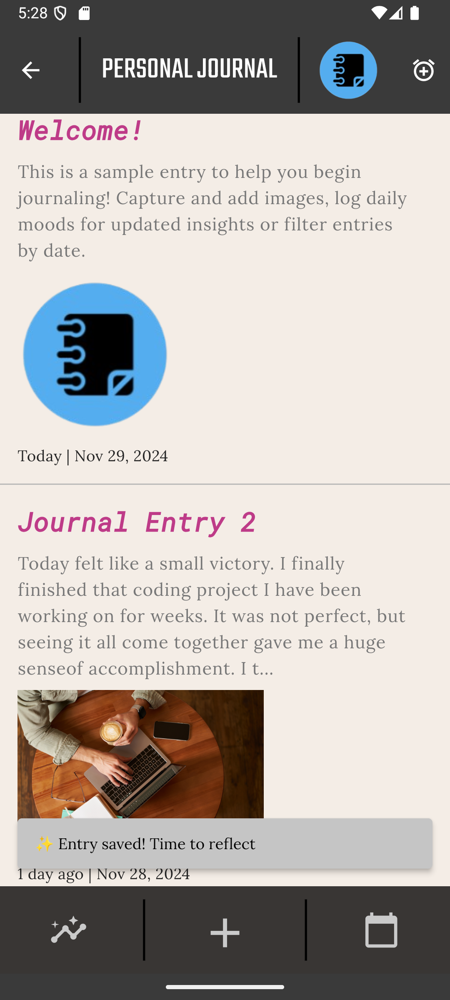
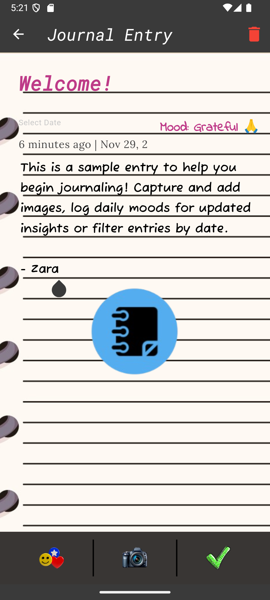
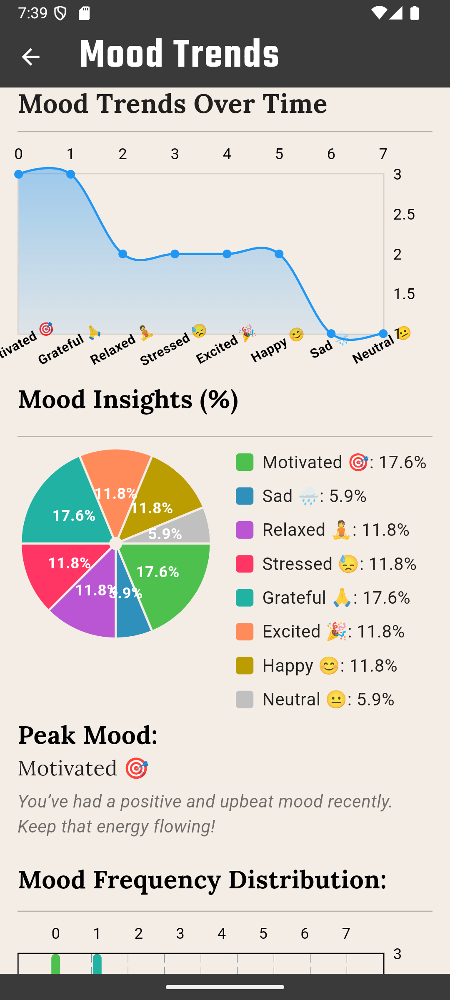
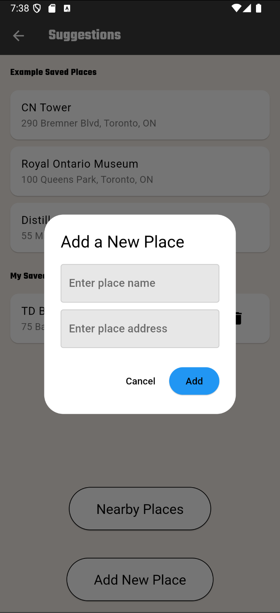

# LIFE PALETTE


## Your All-in-One Companion
Welcome to **Life Palette** – your all-in-one vintage-inspired lifestyle companion app. Life Palette is designed to simplify and enhance day-to-day activities, integrating multiple functionalities into one seamless platform. Whether you're organizing your wardrobe, managing recipes, or journaling your thoughts, Life Palette helps you stay on top of your day-to-day life with ease and simplicity.  

Packed with features for personal improvement and well-being, Life Palette focuses on **minimalism** and **efficiency**. It’s your ultimate tool to streamline your lifestyle and bring a sense of balance and control.
<div align="center">
  
  
  
</div>

## Features  
### 🧥 **Wardrobe Management**  
Take control of your wardrobe with Life Palette.
- **Display outfit cards** in outfit dashboard.
- **Organize with tags and categories** such as tops, bottoms, warm weather clothes, and basics and navigate them through selecting categories or simply by searching by title/category of item.
- **Save Favourite outfits** separately in favourite outfit page, and set reminders to log outfit of the day.
- Through **edit wardrobe** easily edit or delete your outfits and by clicking on build outfit to  create an outfit by uploading/capturing/adding image URL to build outfit card.
- Also find **nearby places** to shop by clicking on similar outfit in outfit card.
- **Browse your collection** anytime, anywhere. Never wonder what to wear again!

<div align="center">
       
       
       
       
       
       
</div>

### 🍳 **Recipe Catalog**, powered by **Firestore** for seamless data management.
Keep your favorite meals organized with our recipe storage feature.  
- **Using Firestore,** save recipes and categorize them by meal type and search for a specifice recipe.
- **View key stats** like preparation time and difficulty.
- **Full recipe display** includes cooking steps, images, and a description.  
- **Favorite recipes** to easily find them later.
<div align= "center">
  
  
  
</div>

### 📔 **Personal Journal**  
Reflect on your day and track your mood with Life Palette’s personal journaling feature.  
- **Log daily moods** and activities for self-reflection, with **local data storage** using SharedPreferences. 
-  **Built-in camera** feature to capture images and add to entries.  
- **Use data charts** to analyse mood trends over time to gain insights into your mental well-being.  
- **Snackbars** provide real-time feedback for actions like saving or deleting entries.  
- **Search entries** by date, allowing you to revisit past moments. 
<div align= "center">
  
  
  
</div>

### 🌟 **Personalized Suggestions**
Discover places to eat, shop, and explore with tailored recommendations based on your location.
- Utilizes **HTTP requests** to fetch and display nearby attractions and amenities in real time.
- Effortlessly **plan your outings** without leaving the app, by **adding places**.
 <div align="center">
  
  
  
</div>

### ⚙️ **Settings**
Customize your experience.
- Enable **snackbars** and **notifications** for key updates and reminders.
- Activate **dark mode** or change appearance to fit your needs.
- **Cloud data** deletion.
<div align="center">
  
  
</div>

## How to Run the Project

1. Clone the repository:
   ```bash
   git clone https://github.com/consnel8/LifePalette.git
2. Open Android Studio then open and choose the project folder:
   ```bash
   cd LifePalette
4. Install dependencies:
   ```bash
   pub get
5. Run:
   ```
   Shift+F10


## **Group Members/Contributors**  
- Megan Brandreth, mbrandreth  
- Zara Farrukh, zarafarrukh  
- Connor Snelgrove, consnel8  
- Eisha Rizvi, eisharizvi  
- Syeda Muqadas, Syeda-Muqadas  
